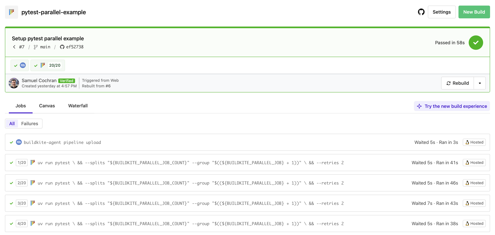

# pytest-parallel-example

[](https://buildkite.com/buildkite/pytest-parallel-example/builds/latest?branch=main)
[](https://buildkite.com/new)

This repository is an example [Buildkite](https://buildkite.com/) pipeline that runs a [Python](https://python.org) integration test suite using [pytest](https://docs.pytest.org/en/stable/) configured to use [paralellism](https://buildkite.com/docs/pipelines/tutorials/parallel-builds#parallel-jobs).

👉 **See this example in action:** [buildkite/pytest-parallel-example](https://buildkite.com/buildkite/pytest-parallel-example/builds/latest?branch=main)

See the full [Getting Started Guide](https://buildkite.com/docs/guides/getting-started) for step-by-step instructions on how to get this running, or try it yourself:

[](https://buildkite.com/new)

<a href="https://buildkite.com/buildkite/pytest-parallel-example/builds/latest?branch=main">
  
</a>

## How does it work

This repo has a little python project with 100 integration tests, which currently just sleep for a random amount of time then pass 99% of the time. We're using [uv](https://docs.astral.sh/uv/) to run Python.

We start by using a single [command step](https://buildkite.com/docs/pipelines/configure/step-types/command-step) to run pytest:

```yaml
# .buildkite/pipeline.yml
steps:
  - command: uv run pytest
```

Then we add [parallelism](https://buildkite.com/docs/pipelines/configure/step-types/command-step#parallelism) set to 20 so it turns into 20 jobs across 20 agents:

```yaml
steps:
  - command: uv run pytest
    parallelism: 20
```

But that runs every test in every job, so we use [pytest-split](https://pypi.org/project/pytest-split/), [`$BUILDKITE_PARALLEL_JOB`](https://buildkite.com/docs/pipelines/configure/environment-variables#BUILDKITE_PARALLEL_JOB) and [`$BUILDKITE_PARALLEL_JOB_COUNT`](https://buildkite.com/docs/pipelines/configure/environment-variables#BUILDKITE_PARALLEL_JOB_COUNT) to make each job run a different chunk of the tests:

```yaml
steps:
  - command: |
      uv run pytest \
        --splits "$${BUILDKITE_PARALLEL_JOB_COUNT}" \
        --group "$$(($${BUILDKITE_PARALLEL_JOB} + 1))"
    parallelism: 20
```

Note we have to escape the `$` because pipeline uploads perform interpolation at upload time and we want to take the variables within each the job instead.

We also do some math because `$BUILDKITE_PARALLEL_JOB` starts at `0` but pytest-split expects `--group` to start at `1`.

Finally, because this is an integration test suite, test reliability is not always 100%. So we use [pytest-retry](https://pypi.org/project/pytest-retry/) to retry failed tests:

```yaml
steps:
  - command: |
      uv run pytest \
        --splits "$${BUILDKITE_PARALLEL_JOB_COUNT}" \
        --group "$$(($${BUILDKITE_PARALLEL_JOB} + 1))" \
        --retries 2
    parallelism: 20
```

Next steps could be to extract this into a script file, to make that interpolation less awkward. We can also add a [log group](https://buildkite.com/docs/pipelines/configure/managing-log-output#grouping-log-output) to make the log output a little nicer. For example:

```bash
# .buildkite/steps/pytest

echo "+++ Running pytest"
uv run pytest \
  --splits "${BUILDKITE_PARALLEL_JOB_COUNT}" \
  --group "$((${BUILDKITE_PARALLEL_JOB} + 1))" \
  --retries 2
```

```yaml
steps:
  - command: .buildkite/steps/pytest
    parallelism: 20
```

Lovely ✨

To go further, we could [integrate Buildkite Test Engine](https://buildkite.com/docs/test-engine/test-collection/python-collectors#pytest-collector) which can more intelligently manage the split of our test suite. It is aware of the historical timing of tests so can spread tests across jobs so they take roughly the same amount of time, eliminating long tail jobs, meaning your builds finish sooner. It can also manage tests that are known to be flaky, suppressing failures based on rules and managing team workflows to resolve flakey tests, increasing the reliability of your test suite over time.

<!-- TODO: demonstrate failure output -->

<!-- TODO: integrate annotations -->
